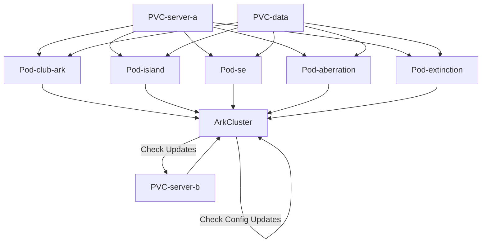

# ARK Operator

K8s operator for managing ARK: Survival Ascended server clusters. Because this project is to designed to manage all things related to running ARK in k8s, it can be used for a few other things as well.

## Server CLI

You can use the `arkctl server` interface to help you with an ARK server.

### Install

`ark-operator` is not available on PyPi due to some upstream dependencies also not being on PyPi. But it can still be easily installed through [pipx](https://pipx.pypa.io/latest/installation/).

```bash
pipx install git+https://github.com/AngellusMortis/ark-operator@master
```

You can also use the latest container image as well.

```bash
function arkctl() {
    docker pull ghcr.io/angellusmortis/arkctl:master
    docker run --rm run ghcr.io/angellusmortis/arkctl:master "$@"
}
```

### RCON

```bash
arkctl server --host 127.0.0.1 --rcon-password password rcon ListPlayers

arkctl server --host 127.0.0.1 --rcon-password password save
# ^ same as
arkctl server --host 127.0.0.1 --rcon-password password rcon SaveWorld

arkctl server --host 127.0.0.1 --rcon-password password broadcast msg
# ^ same as
arkctl server --host 127.0.0.1 --rcon-password password rcon ServerChat msg

arkctl server --host 127.0.0.1 --rcon-password password shutdown
# ^ same as
arkctl server --host 127.0.0.1 --rcon-password password rcon SaveWorld
arkctl server --host 127.0.0.1 --rcon-password password rcon DoExit
```

## Server Container

### Requirements

* **A Container Engine** -- Docker, Podman, Containerd, whatever should work
* **linux/amd64 Container Host** -- Either via Docker Desktop on Windows/WSL or similar or an actual Linux machine. MacOS (ARM64) will **not** work.
* **2 Volumes, at least 50GB each** -- one for ARK server, one for save data

### Docker Compose

Below is an example `docker-compose.yml` file:

#### .env
```
# shared envs

ARK_SERVER_RCON_PASSWORD=password
# only enable auto-update on one server
ARK_SERVER_AUTO_UPDATE=false
```

#### docker-compose.yml
```yml
services:
  club-ark:
    image: ghcr.io/angellusmortis/ark-server:v0.10.3
    env_file: .env
    environment:
      ARK_SERVER_MAP: BobsMissions_WP
      ARK_SERVER_SESSION_NAME: ASA Club Ark
      ARK_SERVER_RCON_PORT: "27020"
      ARK_SERVER_GAME_PORT: "7777"
      # only enable auto-update on one server
      ARK_SERVER_AUTO_UPDATE: "true"
    healthcheck:
      test: [ "CMD", "sh", "-c", "arkctl server --host 127.0.0.1 rcon ListPlayers" ]
      interval: 5s
      timeout: 5s
      retries: 5
      start_period: 30s
      start_interval: 10s
    volumes:
      - ./server:/srv/ark/server
      - ./data:/srv/ark/data
      - ./data/maps/BobsMissions_WP/saved:/srv/ark/server/ark/ShooterGame/Saved
      - ./data/maps/BobsMissions_WP/mods:/srv/ark/server/ark/ShooterGame/Binaries/Win64/ShooterGame
      - ./data/lists/PlayersExclusiveJoinList.txt:/srv/ark/server/ark/ShooterGame/Binaries/Win64/PlayersExclusiveJoinList.txt
      - ./data/lists/PlayersJoinNoCheckList.txt:/srv/ark/server/ark/ShooterGame/Binaries/Win64/PlayersJoinNoCheckList.txt
    # should be the UID / GID of your current user
    user: "1000:1000"
    ports:
      - "27020:27020"
      - "7777:7777"
  island:
    image: ghcr.io/angellusmortis/ark-server:v0.10.3
    env_file: .env
    environment:
      ARK_SERVER_MAP: TheIsland_WP
      ARK_SERVER_SESSION_NAME: ASA The Island
      ARK_SERVER_RCON_PORT: "27021"
      ARK_SERVER_GAME_PORT: "7778"
    healthcheck:
      test: [ "CMD", "sh", "-c", "arkctl server --host 127.0.0.1 rcon ListPlayers" ]
      interval: 5s
      timeout: 5s
      retries: 5
      start_period: 30s
      start_interval: 10s
    volumes:
      # server volume should be read-only on all
      # containers that do not have auto-update on
      - ./server:/srv/ark/server:ro
      - ./data:/srv/ark/data
      - ./data/maps/TheIsland_WP/saved:/srv/ark/server/ark/ShooterGame/Saved
      - ./data/maps/TheIsland_WP/mods:/srv/ark/server/ark/ShooterGame/Binaries/Win64/ShooterGame
      - ./data/lists/PlayersExclusiveJoinList.txt:/srv/ark/server/ark/ShooterGame/Binaries/Win64/PlayersExclusiveJoinList.txt
      - ./data/lists/PlayersJoinNoCheckList.txt:/srv/ark/server/ark/ShooterGame/Binaries/Win64/PlayersJoinNoCheckList.txt
    # should be the UID / GID of your current user
    user: "1000:1000"
    ports:
      - "27021:27021"
      - "7778:7778"
```

#### Setup

```bash
# make all of the directories that will be bind mounted so they are not owned by root
mkdir -p \
    server/ark/ShooterGame/Saved \
    server/ark/ShooterGame/Binaries/Win64/ShooterGame \
    data/maps/BobsMissions_WP/saved \
    data/maps/BobsMissions_WP/mods \
    data/maps/TheIsland_WP/saved \
    data/maps/TheIsland_WP/mods
# let auto-update server initialize everything
docker compose up -d club-ark
# watch logs
docker compose logs club-ark -f
# and wait for it to say "Server: "ASA Club Ark" has successfully started!"

# then start rest of servers
docker compose up -d
```

#### Updating ARK

```bash
# stop all servers
docker compose stop
# run auto-update server
docker compose up -d club-ark
# watch logs
docker compose logs club-ark -f
# and wait for it to say "Server: "ASA Club Ark" has successfully started!"

# then start rest of servers
docker compose up -d
```

### Global GameUserSettings.ini

For any server that is ran that is _not_ Club Ark (map=`BobsMissions_WP`), the container will automatically attempt to merge a `GameUserSettings.ini` that is located at `data/GameUserSettings.ini` with the one in the map specific `saved` directory. So you can set all of your common/shared settings in `data/GameUserSettings.ini` and then your map specific ones in `saved/Config/WindowsServer/GameUserSettings.ini`.

### Environment Variables

Below a list of available environment variables.

| env                           | default     | description                                      |
|-------------------------------|-------------|--------------------------------------------------|
| ARK_SERVER_RCON_PASSWORD      |             | Required. RCON / Admin password for the server.  |
| ARK_SERVER_MAP                |             | Required. The map for the server.                |
| ARK_SERVER_SESSION_NAME       |             | Required. Session name for server.               |
| ARK_SERVER_AUTO_UPDATE        | true        | If server should auto-update (Steam) or not.     |
| ARK_SERVER_RCON_PORT          | 27020       | The RCON port for server.                        |
| ARK_SERVER_GAME_PORT          | 7777        | The game port for the server.                    |
| ARK_SERVER_MULTIHOME          |             | Multihome IP for the server. Use when you public IP does not match the IP players should connect to. |
| ARK_SERVER_MAX_PLAYERS        | 70          | Max number of players allowed.                   |
| ARK_SERVER_CLUSTER_ID         | ark-cluster | Cluster ID for server cluster.                   |
| ARK_SERVER_BATTLEYE           | true        | If BattlEye should be enabled.                   |
| ARK_SERVER_ALLOWED_PLATFORMS  | ALL         | Allow platforms for server. Comma list.          |
| ARK_SERVER_WHITELIST          | false       | If server should have whitelist.                 |
| ARK_SERVER_PARAMS             |             | Comma list of additional params (?)              |
| ARK_SERVER_OPTS               |             | Additional list of options (-)                   |
| ARK_SERVER_MODS               |             | Additional list of mods (Club ARK mod automatically added if that is the map). |
| ARK_SERVER_GLOBAL_GUS_SECRETS |             | Extra values for GameUserSettings.ini to load in |
| ARK_OP_LOG_FORMAT             | basic       | Logging format. Choices: auto, rich, basic, json |
| ARK_OP_LOG_LEVEL              | INFO        | Log level. Choices: DEBUG, INFO, WARNING, ERROR  |

### Managed Parameters, Options and Settings

`arkctl` manages a lot of stuff for you. As a result you **MUST NOT** set any of the managed parameters, options or settings. All of these can be managed through the above environment variables.

See the [ARK wiki](https://ark.wiki.gg/wiki/Server_configuration) for full list of settings.

#### Managed Parameters (?)

- SessionName
- RCONEnabled
- RCONPort
- ServerAdminPassword

#### Managed Options (-)

- port
- WinLiveMaxPlayers
- clusterid
- ClusterDirOverride
- NoTransferFromFiltering
- ServerPlatform
- NoBattlEye
- exclusivejoin
- MULTIHOME
- mods

#### Managed GameUserSettings

- ServerSettings -> RCONEnabled
- ServerSettings -> RCONPort
- ServerSettings -> ServerAdminPassword
- SessionSettings -> Port
- SessionSettings -> SessionName
- SessionSettings -> MultiHome
- MultiHome -> Multihome

## K8s Operator

Ark Operator will manage a cluster or ARK: Survival Ascended servers using an A/B or Blue/Green deployment pattern. Two ARK installs on two different PVCs. One used for checking for updates and one mounted read-only for the servers to use. There is a third data PVC for all save data and mod downloads.



### Manifests

There are two example manifests provided one with mod update checks (requires a [CurseForge API key](https://console.curseforge.com/)) and one without.

#### No Mod Updates

The simple example for the operator can be found at [operator.yml](https://github.com/AngellusMortis/ark-operator/blob/master/examples/operator.yml). This manifest will create:

* A Deployment to run the operator
* A Service Account for the operator
* A Cluster Role / Cluster Role Binding to give the Service Account access to watch and list ArkCluster objects
* A Role / Role Binding for your namespace to give the Service Account access to ArkCluster, pods, PVC, Config Map, Secret and Service objects so it can manage Ark Clusters

To install:

1. Install the CRDs:
  ```bash
  kubectl apply -f https://raw.githubusercontent.com/AngellusMortis/ark-operator/refs/heads/master/src/ark_operator/resources/crds.yml
  ```
2. Download manifest
3. Search for `==== Replace` and replace all of the namespaces with the namespace you want to install the operator in
4. Apply manifests

#### Mod Updates

If you want Ark Operator to be able to check for mod updates. You need to go to [CurseForge](https://console.curseforge.com/) and get an API key. The example manifest can be found at [operator-mod-updates.yml](https://github.com/AngellusMortis/ark-operator/blob/master/examples/operator-mod-updates.yml). This manifest will create all of the same things as the above no mod manfiest, but also:

* A secret with your CurseForge API key that is injected to the Ark Operator deployment

To Install:

1. Install the CRDs:
  ```bash
  kubectl apply -f https://raw.githubusercontent.com/AngellusMortis/ark-operator/refs/heads/master/src/ark_operator/resources/crds.yml
  ```
2. Download manifest
3. Search for `==== Replace` and replace all of the namespaces with the namespace you want to install the operator in
4. Search for `ARK_OP_CURSEFORGE_API_KEY` and replace `api-key` with your CurseForge API key
5. Apply manifests

#### Cluster

After installing the operator, you need to make an ArkCluster for the operator to manage. A simplified example manifest can be found at [cluster-simple.yml](https://github.com/AngellusMortis/ark-operator/blob/master/examples/cluster-simple.yml). Which will create a cluster with all of the Officially released maps by Wildcard with all of the default settings.

A more in depth example can be found at [cluster-full.yml](https://github.com/AngellusMortis/ark-operator/blob/master/examples/cluster-full.yml) which has mods and per map config overrides.

##### Configs / Secrets

The ark operator will attempt to load the following Config Maps and Secrets to apply to the maps it runs. `{instance_name}` is the name of your `ArkCluster` object. `{map_slug}` is the slug that Ark Operator generates for a map. This will be the name of pods that created by the operator. Pods are in format: `{instance_name}-{map_slug}`. Map slug has to be used in many places because the actual map ID is not valid for Kubernetes objects.

> [!WARNING]
> The following Global envs/configs will NOT be applied to the `BobsMissions_WP` map. In many cases, you do not want the same settings on Club Ark you want for other maps, so you need map specific overrides for Club Ark.
>
> Ignored Global Envs:
> * ARK_SERVER_PARAMS
> * ARK_SERVER_OPTS
> * ARK_SERVER_MODS
>
> Ignored Global Configs:
> * GameUserSettings.ini
> * Game.ini

* Config Map, `{instance_name}-global-envs` - [Environment Variables](#environment-variables) to apply to all maps. Will override values in `ArkCluster` object. `ARK_SERVER_PARAMS`, `ARK_SERVER_OPTS`, and `ARK_SERVER_MODS` are ignored for `BobsMissions_WP`.
* Config Map, `{instance_name}-global-ark-config` - A config map that can have `Game.ini` and `GameUserSettings.ini` keys to apply a global config to all maps. Will be ignored for `BobsMissions_WP`.
* Secret, `{instance_name}-cluster-secrets` - A secret you can apply [Environment Variables](#environment-variables) and configs to all servers. Can override values in `ArkCluster`.
* Config Map, `{instance_name}-map-envs-{map_slug}` - [Environment Variables](#environment-variables) to apply to a specific map. Will override values in both `ArkCluster` object and `-global-envs`.
* Config Map, `{instance_name}-map-ark-config-{map_slug}` - A config map that can have `Game.ini` and `GameUserSettings.ini` keys to apply a config to a specific map. Will override values from `-global-ark-config`

### Helm

> [!WARNING]
> WIP come back later.

### Cluster CLI

You can use the `arkctl cluster` interface to help you manage your Ark Cluster.

### Install

`ark-operator` is not available on PyPi due to some upstream dependencies also not being on PyPi. But it can still be easily installed through [pipx](https://pipx.pypa.io/latest/installation/).

```bash
pipx install git+https://github.com/AngellusMortis/ark-operator@master
```

You can also use the latest container image as well.

```bash
function arkctl() {
    docker pull ghcr.io/angellusmortis/arkctl:master
    docker run --rm run ghcr.io/angellusmortis/arkctl:master "$@"
}
```

`arkctl` will automatically re-use your existing Kubernetes authentication. So the only two values you need to apply for the CLI to work is `--name` and `--namespace`. These values can also be provided via the envs `ARK_CLUSTER_NAME` and `ARK_CLUSTER_NAMESPACE`.

```bash
# via options
arkctl cluster --name ark --namespace default rcon ListPlayers

# via ENVs
export ARK_CLUSTER_NAME=ark
export ARK_CLUSTER_NAMESPACE=default
arkctl cluster rcon ListPlayers
```

### Suspend / Resume

If you want Ark Operator to _stop_ managing specific maps for a short time

```bash
# stop managing ark-island pod
arkctl cluster suspend TheIsland_WP

# resume managing ark-island pod
arkctl cluster resume TheIsland_WP
```

### RCON

```bash
arkctl cluster rcon ListPlayers

arkctl cluster save
# ^ same as
arkctl cluster rcon SaveWorld

arkctl cluster broadcast msg
# ^ same as
arkctl cluster rcon ServerChat msg

# will do a shutdown using gracefulShutdown
arkctl cluster shutdown

# will do a shutdown using a custom wait interval
arkctl cluster shutdown --wait-interval 10m

# will suspend all maps after shutdown to prevent restart
arkctl cluster shutdown --suspend

# will do an instant shutdown via RCON
arkctl cluster shutdown --force
# ^ same as
arkctl cluster rcon SaveWorld
arkctl cluster rcon DoExit

# will do a rolling restart (one map at a time) using gracefulShutdown
arkctl cluster restart

# will do a rolling restart using a custom wait interval
arkctl cluster restart --wait-interval 10m

# will do a rolling restart using new active-volume value and set it after completion
arkctl cluster restart --active-volume server-a
```

### Check for Updates

A helper command for debugging / troubleshooting to see if there are any ARK or mod updates. Will list the current active Steam buildid used by servers and the latest one. If there is a newer version, it will trigger the automated update process. Will also list all used mods and the last update for each.

To check for mod updates, the env `ARK_OP_CURSEFORGE_API_KEY` has to be set.

```bash
arkctl cluster check-updates
```

## Development

### Requirements

* [Docker](https://docs.docker.com/get-started/get-docker/) or a container engine that is compatible with VS Code
* [VS Code with Dev Containers](https://code.visualstudio.com/docs/devcontainers/containers)
* A local Kubernetes cluster (1.30+) with at least 100GB of PVC storage, credentials should be set up in the default `~/.kube` folder
* The namespace `ark-dev` for local dev (you can change this, but it requires editing files that are not gitignored)

### Setup

1. Clone repo
2. Open the folder in VS Code
3. You will be prompted to "Reopen folder to develop in a container", click "Reopen in Container"

### Testing

Test is fully integrated with the dev container and VS Code. You can run tests fully with

* VS Code's test explorer
* Run `pytest` or `pytest -m 'not k8s'` directly from command line
* Run `test-code` or `test-code --fast` directly from command line
* Run the "Test Code" or "Test Code (fast)" tasks in VS Code (Command Palette -> Tasks: Run Task -> Test Code)

The "fast" option for the tests will ignore the `k8s` mark and run only tests that do not require a k8s cluster to run (no e2e tests).

### Formating & Linting

Similar to testing, it is fully integrated with the dev container and VS Code. You can run formatting and linting with

* VS Code will do _most_ of the linting/formatting by default everytime you save and edit code
* Run `format-code` and `lint-code` directly from the command line (check the files in `.bin/` to see the full list of commands)
* Run the "Format & Lint Code" task in VS Code (Command Palette -> Tasks: Run Task -> Format & Lint Code)
